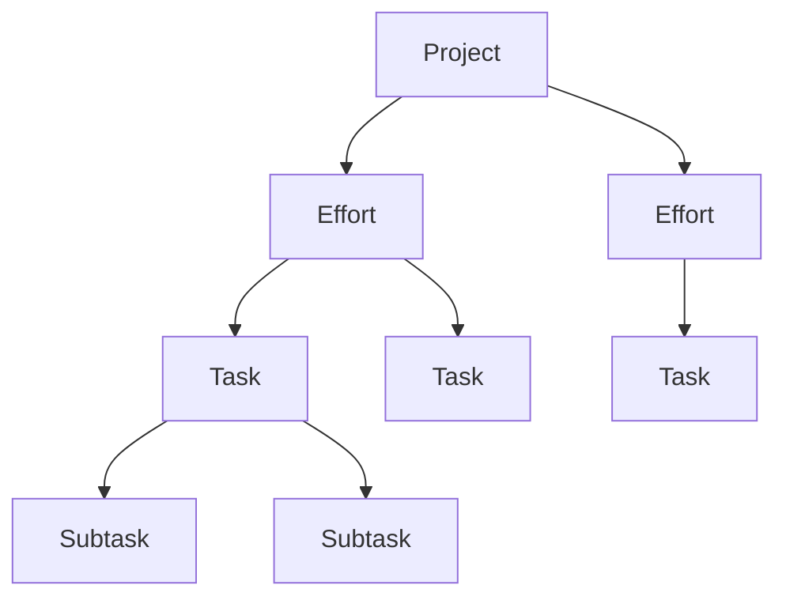
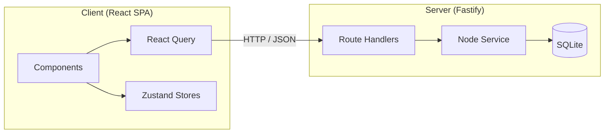

# Todo BMAD Style

A personal planning application for tracking projects, efforts, tasks, and notes — all in one place.

## Table of Contents

- [Overview](#overview)
- [Tech Stack](#tech-stack)
- [Getting Started](#getting-started)
- [Core Concepts](#core-concepts)
- [Project Structure](#project-structure)
- [Available Scripts](#available-scripts)
- [Testing](#testing)
- [Architecture Overview](#architecture-overview)

## Overview

Todo BMAD Style is a full-stack task management application built for individuals who want a single workspace to plan, organize, and take notes on everything they are working on. You create **projects** as top-level containers, break them into **efforts**, define **tasks** within those efforts, and optionally add **subtasks** for granular tracking. Every node in this hierarchy has a built-in **Markdown editor**, so your plans and notes live right next to the work they describe.




## Tech Stack

### Frontend


| Technology            | Purpose                                              |
| --------------------- | ---------------------------------------------------- |
| React 19 + TypeScript | UI framework                                         |
| TanStack Router       | File-based routing with code splitting               |
| TanStack React Query  | Server state, caching, and optimistic updates        |
| Zustand               | Client-side UI state (active project, tabs, sidebar) |
| TipTap                | Rich Markdown editor with task list support          |
| dnd-kit               | Drag-and-drop tree operations                        |
| TanStack Virtual      | Virtualized scrolling for large trees                |
| Tailwind CSS          | Utility-first styling                                |
| Vite                  | Dev server and build tooling                         |


### Backend


| Technology              | Purpose                                            |
| ----------------------- | -------------------------------------------------- |
| Fastify                 | HTTP server framework                              |
| SQLite + better-sqlite3 | Embedded relational database                       |
| Drizzle ORM             | Type-safe database queries and migrations          |
| Zod                     | Request/response validation (shared with frontend) |


### Shared

Use the `packages/shared` package for Zod schemas, TypeScript types, and constants shared by both client and server. This ensures type safety and validation consistency across the entire stack.

## Getting Started

### Docker (Recommended)

The fastest way to get up and running. You only need **Docker** and **Docker Compose** installed.

```bash
# Clone the repository
git clone <repo-url>
cd todo-bmad-style

# Build and start the application
docker compose up -d
```

Once the containers are healthy, open <http://localhost:8080> in your browser.

To customize the client port, set the `CLIENT_PORT` environment variable:

```bash
CLIENT_PORT=3000 docker compose up -d
```

Docker Compose handles everything automatically — building multi-stage images for the client (Nginx) and server (Node.js), running database migrations on startup, and persisting your data in a named volume (`todo-data`).

To stop the application:

```bash
docker compose down
```

Your data persists across restarts. To remove the data volume as well:

```bash
docker compose down -v
```

### Local Development

Use this approach when you want to develop and modify the codebase.

#### Prerequisites

- **Node.js** (v18 or later)
- **pnpm** (v8 or later)

#### Installation

```bash
# Clone the repository
git clone <repo-url>
cd todo-bmad-style

# Install dependencies
pnpm install

# Generate and apply database migrations
pnpm db:generate
pnpm db:push
```

#### Run in Development

```bash
pnpm dev
```

This starts both the client and server concurrently:

- **Client:** <http://localhost:5173>
- **API Server:** <http://localhost:3001>

#### Build for Production

```bash
pnpm build
```

## Core Concepts

### Hierarchy

You organize your work in a strict four-level hierarchy:


| Level | Node Type   | Parent      | Description                                 |
| ----- | ----------- | ----------- | ------------------------------------------- |
| 1     | **Project** | None (root) | Top-level container for a body of work      |
| 2     | **Effort**  | Project     | A workstream or initiative within a project |
| 3     | **Task**    | Effort      | A specific piece of work within an effort   |
| 4     | **Subtask** | Task        | A granular step within a task               |


You navigate this hierarchy through a **tree view** in the main content area. Expand and collapse nodes, drag and drop to reorder or restructure, and use keyboard shortcuts for fast navigation.

### Projects

Projects are top-level items that appear in the **sidebar**. You can:

- Pin frequently accessed projects to the top of the list *(coming soon)*
- Open multiple projects in **tabs** for quick switching
- Drag tabs to reorder them *(coming soon)*

### Efforts, Tasks, and Subtasks

Within a project, you build out your plan by creating efforts, then tasks under those efforts, and optionally subtasks under tasks. Each level provides:

- **Completion tracking** — Mark items complete, and completion cascades intelligently through the hierarchy. Completing a parent marks all descendants complete. Completing all children auto-completes the parent.
- **Progress indicators** — Parent nodes display a completion ratio of their children.
- **Drag and drop** — Reorder items or move them between parents with hierarchy validation.
- **Keyboard shortcuts** — Use arrow keys to navigate, Tab/Shift+Tab to indent/outdent, and Ctrl+Arrow keys to reorder.

### Markdown Editor

Every node (project, effort, task, or subtask) includes a **Markdown editor** powered by TipTap. Use it to:

- Write rich notes with headings, lists, code blocks, and links
- Create nested task checklists directly in your notes
- Auto-save changes as you type (with debounce)

The editor preserves your content when switching between tabs or nodes.

## Project Structure

```text
todo-bmad-style/
├── packages/
│   ├── client/                # React SPA
│   │   └── src/
│   │       ├── components/    # UI and feature components
│   │       ├── api/           # API client functions
│   │       ├── queries/       # React Query hooks
│   │       ├── stores/        # Zustand state stores
│   │       ├── hooks/         # Custom hooks (tree, auto-save, navigation)
│   │       └── routes/        # TanStack Router file-based routes
│   │
│   ├── server/                # Fastify API server
│   │   └── src/
│   │       ├── db/            # Drizzle schema and database init
│   │       ├── routes/        # API route handlers
│   │       └── services/      # Business logic (hierarchy, cascade, reorder)
│   │
│   └── shared/                # Shared Zod schemas, types, and constants
│
├── tests/
│   └── e2e/                   # Playwright end-to-end tests
│
└── docs/                      # Audit reports and documentation
```

## Available Scripts

Run these from the project root:


| Script                    | Description                                 |
| ------------------------- | ------------------------------------------- |
| `pnpm dev`                | Start client and server in development mode |
| `pnpm build`              | Build all packages (shared, client, server) |
| `pnpm test`               | Run unit and integration tests              |
| `pnpm test:unit:coverage` | Run tests with coverage report              |
| `pnpm test:integration`   | Run server integration tests                |
| `pnpm test:e2e`           | Run Playwright end-to-end tests             |
| `pnpm test:e2e:ui`        | Run E2E tests with interactive UI           |
| `pnpm db:generate`        | Generate Drizzle database migrations        |
| `pnpm db:push`            | Apply database migrations                   |


## Testing

The project uses a layered testing strategy:

- **Unit tests** (Vitest) — Stores, utilities, and hooks
- **Integration tests** (Vitest) — Server routes and service-layer business logic
- **End-to-end tests** (Playwright) — Full user workflows in a real browser

Run all tests:

```bash
pnpm test && pnpm test:e2e
```

## Architecture Overview

The following diagram shows how the client, server, and database layers connect:




You interact with the server through a REST API. Zod schemas in the **shared** package validate requests on the server and type responses on the client. React Query manages server state with caching and optimistic updates, while Zustand handles ephemeral UI state like active tabs and sidebar width.

### Database

SQLite runs in WAL (write-ahead logging) mode for concurrent read performance. The database file defaults to `~/.todo-bmad-style/data.db` and can be overridden with the `DB_PATH` environment variable.