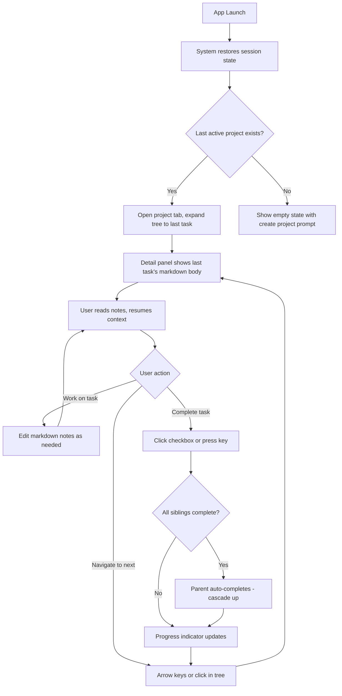
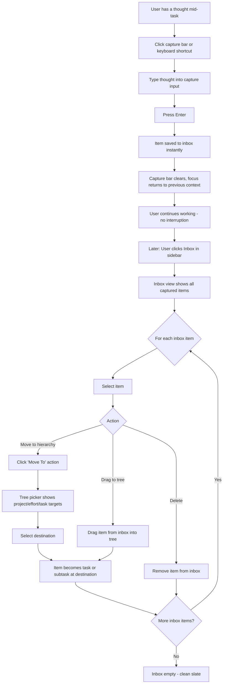
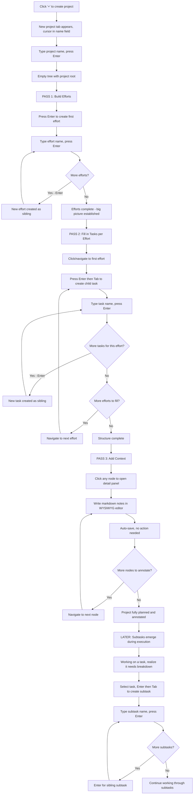
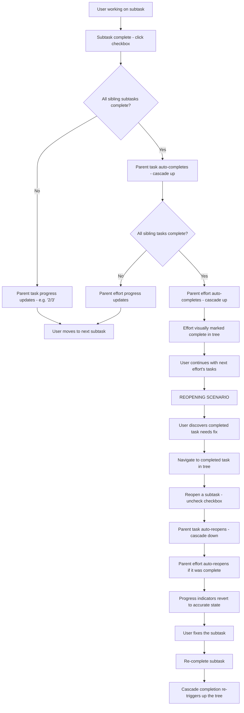

# UX Design Specification todo-bmad-style

**Author:** Willie
**Date:** 2026-03-06

---

## Executive Summary

### Project Vision

A minimalist personal task management web app that replaces the complexity of multi-tool workflows (Notion, Super Productivity, Todoist, notepads) with a single, opinionated interface. The core UX thesis is that productivity tools should disappear — no feature discovery, no configuration decisions, no "how do I do this?" moments. The product achieves this through a fixed four-level hierarchy (Project > Effort > Task > Subtask), file-manager navigation conventions, and the task-as-document pattern where every node is both an action item and a markdown writing surface. It runs entirely offline on localhost with SQLite, reinforcing the personal-tool identity.

### Target Users

**Primary user:** Willie — a solo developer managing multiple personal projects simultaneously. Intermediate-to-advanced technical skill. Accustomed to file managers, code editors, and keyboard-driven workflows. Currently frustrated by the cognitive overhead of enterprise-oriented productivity tools that add team features, integrations, and configuration surfaces he doesn't need. Values speed, clarity, and the ability to switch between project contexts without losing his place. Uses the app on desktop in a browser alongside a code editor.

**Key user behaviors to design for:**
- Frequent context-switching between projects throughout a work session
- Capturing stray thoughts mid-task without breaking flow
- Planning work by building hierarchies and writing markdown notes top-down
- Completing work bottom-up, watching progress cascade through the tree
- Resuming work after breaks (hours or days) with zero re-orientation cost

### Key Design Challenges

1. **Tree density vs. readability** — Projects can contain 200+ nodes. The tree must remain scannable with progress indicators, completion states, and expand/collapse controls without becoming visually cluttered. Information hierarchy within tree rows needs careful spacing and visual weight.

2. **Detail panel coexistence with tree** — The slide-over detail panel with tabbed tasks must feel like a natural extension of the tree, not a competing surface. Focus management during transitions (tree selection → detail panel → markdown editing → back to tree) must be seamless and predictable.

3. **Dual interaction models** — File-manager keyboard navigation and drag-and-drop reordering must coexist cleanly. Keyboard users and mouse users should both feel the app was designed for them, with neither model creating friction for the other.

### Design Opportunities

1. **Resume state as trust signal** — Reliable session restoration (last project, task, scroll position, open tabs) within 2 seconds creates immediate trust and drives daily adoption. This is the app's "first impression" every single time it opens.

2. **Inbox as flow protector** — The capture bar + inbox pattern enables a thought-capture habit that never interrupts active work. If this interaction is fast enough (under 3 seconds), it becomes the behavioral hook that makes the app indispensable.

3. **Cascade completion as progress reward** — Bidirectional status propagation (complete up, reopen down) provides honest, automatic progress feedback. Subtle visual treatment of cascade events can create satisfying momentum signals without animation overhead.

## Core User Experience

### Defining Experience

The defining experience of todo-bmad-style is **building and working through structured plans**. The core loop is: create a task → break it into subtasks → write markdown notes for context → execute. This creation-planning flow is the interaction that must feel most natural and fast. Everything else — tree navigation, completion cascades, inbox capture, resume state — serves this central activity. If creating tasks, nesting subtasks, and writing markdown notes feels effortless, the product succeeds. If any friction exists in that flow, nothing else compensates.

The secondary core loop — resume → navigate → complete → capture — depends on the first. You can only resume meaningful context if the planning flow produced rich, well-structured content. Cascade completion only feels rewarding when the hierarchy was thoughtfully built. The creation flow is both the most frequent action and the one that generates all downstream value.

### Platform Strategy

- **Platform:** Desktop web browser via localhost (React SPA + local Fastify server)
- **Primary input:** Keyboard-first with full mouse support — both must feel native, not bolted on
- **Screen assumptions:** Desktop-sized viewport (1280px+). No mobile or tablet support required
- **Browser support:** Modern evergreen browsers only (Chrome, Firefox, Safari, Edge)
- **Offline:** Fully offline by design — no network dependency, no cloud, no sync. SQLite local storage
- **Context:** Used alongside a code editor, so the app competes for screen attention. Must be information-dense without feeling cluttered. Quick in, quick out

### Effortless Interactions

1. **Task and subtask creation** — Creating a new node at any level should be instantaneous. No modals, no forms, no mandatory fields. Type a name, hit Enter, it exists. Nesting should be as natural as indenting — create a subtask under a task with a single action, not a multi-step process.

2. **Markdown editing** — Switching from tree navigation into markdown editing and back should be seamless. No "edit mode" toggle, no save button. The markdown body is always there, always editable, always rendered. Writing notes while planning should feel like writing in a document, not filling out a form field.

3. **Hierarchy building** — Going from empty project to fully structured plan should flow naturally top-down: create effort, tab in, create tasks, tab in, create subtasks, write notes. The tree should feel like an outliner — the kind of rapid hierarchy building that outliners like Workflowy enable.

4. **Inbox capture** — Type, Enter, gone. Under 3 seconds. No decisions about destination. The thought is preserved, the flow is unbroken.

5. **Resume** — Open the app, you're exactly where you were. No navigation, no searching, no remembering. This happens automatically and reliably every time.

### Critical Success Moments

1. **First project planning session** — The moment Willie builds out a full project hierarchy with notes in under 20 minutes and thinks "this is faster than Notion." This is the adoption moment. If the creation flow feels slow or awkward here, the app gets abandoned.

2. **First resume experience** — Opening the app the next day and landing exactly on the last task with notes visible. This is the trust moment. It proves the app respects your context.

3. **First cascade completion** — Completing the last subtask and watching the parent task, then the effort, auto-complete. This is the reward moment. It validates that the structure you built is working for you.

4. **First inbox-to-tree promotion** — Capturing a thought mid-task, then later organizing inbox items into the right place in the hierarchy. This is the flow-protection moment. It proves you never have to break concentration to file things.

### Experience Principles

1. **Creation is the core act** — The app exists to help you build structured plans and execute them. Every design decision prioritizes the speed and fluidity of creating nodes and writing markdown. If a feature slows down creation, it doesn't ship.

2. **Structure should emerge, not be configured** — Four levels, no labels, no priorities, no custom fields. The hierarchy IS the organization system. Users create clarity through nesting and notes, not through metadata and configuration.

3. **The tool disappears** — No feature discovery, no onboarding, no "how do I do this?" moments. Every interaction follows conventions the user already knows (file managers, outliners, markdown editors). The app should feel familiar on first use.

4. **Context is sacred** — Never lose the user's place. Resume state, persistent markdown bodies, inbox capture without context-switching — every feature protects the user's mental context. Interrupting flow is a bug.

5. **Honest progress** — The tree never lies. Cascade completion and reopening ensure that what's marked done is actually done. Progress indicators reflect reality, not optimism.

## Desired Emotional Response

### Primary Emotional Goals

1. **Clarity** — At every moment, the user knows exactly where they are, what they're looking at, and what they can do. No ambiguity, no hidden menus, no "what does this button do?" The interface communicates through structure, not explanation.

2. **Flow** — The app never interrupts. Creating, navigating, completing, capturing — every action chains into the next without friction. The tool stays out of the way and lets the user think about their work, not the tool.

3. **Confidence** — The user trusts the app completely. Trust that their context is preserved. Trust that completion status is honest. Trust that captured thoughts won't be lost. Trust that the hierarchy they built is the single source of truth.

### Emotional Journey Mapping

| Stage | Desired Emotion | What Triggers It |
|---|---|---|
| Opening the app | Relief, continuity | Resume state drops you right back where you were |
| Planning a project | Excitement, clarity | Hierarchy builds quickly, notes capture thinking in real time |
| Mid-task capture | No interruption (neutral) | Inbox capture is so fast it doesn't register as a context switch |
| Working through tasks | Focus, momentum | Tree navigation is instant, markdown is always visible |
| Completing work | Satisfaction, earned progress | Cascade completion visually confirms real progress |
| Organizing inbox | Control, clean slate | Items filed quickly, inbox reaches zero |
| Returning after days | Trust, familiarity | Everything is exactly where you left it |

### Micro-Emotions

**Prioritized emotional states:**

- **Confidence over confusion** — Every interaction has one obvious path. No wondering "where did that go?" or "how do I get back?"
- **Calm over anxiety** — The interface is quiet. No notification badges, no urgency signals, no red indicators screaming for attention. You set your own pace.
- **Accomplishment over frustration** — Progress is visible and honest. The tree shows what's done and what's left without judgment or pressure.
- **Trust over skepticism** — Data persists reliably. Resume state works every time. Cascade logic is predictable and transparent.

**Emotions to actively prevent:**
- Confusion from unclear UI state or hidden functionality
- Frustration from features getting in the way of the core task
- Overwhelm from too many options, settings, or visual noise
- Anxiety from wondering if data was saved or context was lost

### Design Implications

- **Clarity → Minimal chrome, obvious affordances.** Every interactive element looks interactive. Non-interactive elements stay quiet. No decorative UI. Whitespace is a feature, not wasted space.
- **Flow → Zero-interrupt transitions.** No modals for creation. No confirmation dialogs for routine actions. No loading spinners for local operations. Actions complete instantly and visibly.
- **Confidence → Predictable, honest UI.** Status changes are immediate and visible. Auto-save is silent but reliable. Breadcrumbs always show location. The tree is always the source of truth.
- **Calm → Restrained visual design.** Muted palette. No animations that demand attention. No badges or counts that create urgency. Progress indicators inform without pressuring.

### Emotional Design Principles

1. **Subtract before adding** — If a UI element creates confusion or competes for attention, remove it. The emotional goal is calm clarity, and every added element is a potential source of noise.

2. **Speed is an emotion** — Instant response times don't just feel fast, they feel trustworthy. Latency creates doubt. Every interaction under 200ms reinforces the feeling that the app is solid and reliable.

3. **Silence is confidence** — No success toasts, no "saved!" confirmations, no "are you sure?" dialogs. The app just works. Silence from the UI communicates that everything is fine — which is the default state.

4. **Progress should feel earned** — Cascade completion and progress indicators reflect real work done. Never gamify, never inflate, never add artificial rewards. The satisfaction comes from honest status, not UI tricks.

## UX Pattern Analysis & Inspiration

### Inspiring Products Analysis

**Super Productivity**
- *What it does well:* Note-taking attached directly to tasks. The task-as-document concept — where a task isn't just a checkbox but a writing surface — is the core pattern that inspired this product's markdown body feature.
- *What falls short:* Feature density creates cognitive overhead. Too many capabilities competing for attention, which undermines the simplicity needed for a personal tool.
- *Key takeaway:* The task note is the right idea. The execution needs to be cleaner — markdown body should be prominent and always accessible, not buried behind tabs or secondary UI.

**Todoist**
- *What it does well:* Nesting and hierarchy feel natural. Creating tasks and subtasks is fast. The tree structure is intuitive and scannable.
- *What falls short:* Note-taking is minimal and not intuitive. Tasks are treated as action items only, not as documents. The writing surface is an afterthought, making it inadequate for planning context.
- *Key takeaway:* The nesting model is proven and worth emulating. But this app must go further — every node needs a full markdown body, not just a title and a tiny description field.

**Notion**
- *What it does well:* Powerful, flexible writing surface. Markdown-quality content creation. Rich editing experience that feels like writing in a real document.
- *What falls short:* Too open-ended. No enforced structure means the user must design their own system. This freedom becomes a tax — every session starts with "how should I organize this?" instead of "let me get to work."
- *Key takeaway:* The markdown editing quality is the bar to meet. But the structural opinion — fixed four-level hierarchy, no configuration — is what makes this app different. Structure removes decisions so the user can focus on content.

**File Managers (macOS Finder, Windows Explorer)**
- *What they do well:* Universal interaction conventions — arrow keys to navigate, Enter to rename, Delete to remove, expand/collapse with disclosure triangles. These patterns are deeply ingrained and require zero learning.
- *Key takeaway:* The tree interaction model should feel exactly like a file manager. Don't invent new conventions. Leverage muscle memory the user already has.

**Outliners (Workflowy, Dynalist)**
- *What they do well:* Rapid hierarchy creation. Type, Enter, Tab to indent, Shift+Tab to outdent. Building structure feels like typing, not like using a tool. The outliner model proves that tree-building can be as fast as writing a list.
- *Key takeaway:* The creation flow should borrow the outliner's speed. Creating a task and immediately nesting under it should feel like indenting a bullet point — one keystroke, no menus.

### Transferable UX Patterns

**Navigation Patterns:**
- File-manager tree navigation (arrow keys, expand/collapse) — proven universal convention for hierarchical data
- Breadcrumb trail for location awareness — keeps the user oriented without occupying primary screen space
- Recency-sorted sidebar — mirrors browser history and recent files patterns; surfaces what matters without manual organization

**Interaction Patterns:**
- Outliner-style rapid creation (Enter to create sibling, Tab to nest) — the fastest known pattern for building hierarchies
- Inline rename on Enter — file manager convention, avoids modal dialogs for the most common edit operation
- Click-to-open detail panel — keeps the tree visible while showing task content, similar to split-pane file managers

**Content Patterns:**
- Always-visible markdown body (from Super Productivity's task notes) — no toggle, no separate view, the content is just there
- Auto-save with no confirmation — modern document editors (Google Docs, Notion) have trained users to expect this
- Markdown rendering with edit-in-place — the content is both readable and editable without mode switching

### Anti-Patterns to Avoid

1. **Feature creep UI (Super Productivity)** — Too many buttons, panels, and options visible at once. Every feature added to the screen is attention stolen from the core task. This app must resist adding UI elements that don't serve hierarchy, notes, or completion.

2. **Flat task lists with bolt-on hierarchy (Todoist)** — Todoist's nesting sometimes feels like an addition to a flat list rather than a native tree. The tree must be the primary data structure, not an optional view on top of a list.

3. **Blank canvas paralysis (Notion)** — Open-ended tools require the user to make structural decisions before doing real work. The fixed hierarchy eliminates this by providing structure upfront. Never add "choose your layout" or "customize your workspace" features.

4. **Modal dialogs for routine actions** — Any action the user performs frequently (create, rename, complete, move) must never trigger a modal. Modals break flow and signal that the app considers its own confirmation more important than the user's momentum.

5. **Hidden keyboard shortcuts** — If the app is keyboard-first, every keyboard interaction must be discoverable through the UI (tooltips, visual cues) without requiring a cheat sheet. The file manager model works because the conventions are universal, not hidden.

### Design Inspiration Strategy

**What to Adopt:**
- File-manager tree navigation conventions (arrow keys, Enter, Delete) — universal muscle memory
- Outliner-style rapid hierarchy creation (Enter, Tab, Shift+Tab) — fastest creation pattern
- Always-visible markdown body on selected nodes — core differentiator from Todoist
- Auto-save without confirmation — modern expectation, supports "silence is confidence" principle
- Breadcrumb navigation for hierarchy orientation

**What to Adapt:**
- Super Productivity's task-note pattern — adopt the concept but execute with cleaner, more prominent markdown rendering and no surrounding feature clutter
- Notion's markdown editing quality — match the writing experience but within a fixed structure, not a blank canvas
- Split-pane layout from file managers — adapt for tree + detail panel with tabbed tasks instead of file preview

**What to Avoid:**
- Notion's structural freedom — the fixed hierarchy is a feature, not a limitation
- Todoist's minimal notes — markdown bodies must be first-class, not afterthoughts
- Super Productivity's feature density — every UI element must earn its place
- Modal dialogs, confirmation prompts, and onboarding wizards — conflicts with flow and silence principles

## Design System Foundation

### Design System Choice

**Shadcn/ui + Tailwind CSS** — a copy-paste component primitive library built on Radix UI, styled with Tailwind utility classes. Components are owned in the codebase (not an npm dependency), providing full control while leveraging proven accessible primitives.

### Rationale for Selection

1. **Accessibility built-in** — Radix UI primitives provide ARIA roles, focus management, and keyboard navigation out of the box. Critical for a keyboard-first app with tree views, tabs, panels, and breadcrumbs.

2. **Full ownership, no fighting the framework** — Shadcn/ui components are copied into your project. You can modify any component freely without workaround hacks or version conflicts. When the tree view needs custom keyboard behavior, you change the code directly.

3. **Restrained visual defaults** — Shadcn/ui's default aesthetic is clean, muted, and minimal. Aligns directly with the "calm, quiet interface" emotional goals without needing to strip away opinionated styling (as you would with Material Design).

4. **Tailwind utility-first approach** — No CSS files to manage, no naming conventions to maintain. Styles are colocated with components. Supports the "subtract before adding" principle — you only add what you need.

5. **Solo developer velocity** — Pre-built primitives for the hardest UI patterns (tree, tabs, dialog, dropdown, command palette) accelerate development without imposing design opinions. Build fast, customize freely.

### Implementation Approach

- Install Tailwind CSS as the styling foundation
- Use Shadcn/ui CLI to add individual component primitives as needed (tree, tabs, scroll-area, command, breadcrumb, etc.)
- Components live in `src/components/ui/` — owned code, not dependencies
- Radix UI primitives installed as peer dependencies for accessibility foundations
- Custom theme tokens defined in Tailwind config for consistent spacing, colors, and typography

### Customization Strategy

- **Color palette:** Define a muted, restrained palette in Tailwind config. Neutral grays for chrome, subtle accent for active/selected states, green for completion. No bright colors competing for attention.
- **Typography:** Single monospace or clean sans-serif font. Consistent sizing scale. Markdown rendering uses the same type system.
- **Spacing:** Tight but readable spacing for tree density. Consistent 4px/8px grid for all layout decisions.
- **Component modifications:** Shadcn/ui components will be customized for:
  - Tree view with file-manager keyboard navigation
  - Detail panel with tabbed task views
  - Inline editing for node rename
  - Markdown editor/renderer integration
  - Quick capture bar
- **Dark/light:** Build with CSS custom properties from the start (Shadcn/ui default). Dark mode deferred to Phase 3 but the foundation supports it from day one.

## Defining Core Interaction

### The Defining Experience

**"Build a structured plan and work through it."**

The defining interaction of todo-bmad-style is creating a hierarchical plan — tasks, subtasks, markdown notes — and then executing through it as the tree honestly tracks progress. This is the interaction users would describe: "I open it, build out what I need to do, write my notes, and work through the list." If this feels fast and natural, the app succeeds. Everything else (resume, inbox, search, cascade completion) amplifies this core act but cannot replace it.

In one sentence: **Outliner speed for structure, document quality for notes, file manager conventions for navigation.**

### User Mental Model

The user's mental model is a hybrid of three familiar tools:

1. **Outliner (Workflowy/Dynalist)** — for building structure. Enter to create, Tab to nest, Shift+Tab to outdent. Hierarchy emerges from typing, not from menus or drag-and-drop setup.

2. **Document editor (Notion/Google Docs)** — for writing context. Each node has a WYSIWYG markdown body where formatting renders live as you type. Writing notes feels like writing in a document, not filling out a form.

3. **File manager (Finder/Explorer)** — for navigating and managing. Arrow keys to move through the tree, Enter to rename, Delete to remove, expand/collapse with disclosure triangles. The tree is the primary workspace, not a sidebar or secondary view.

The user does not think of these as separate modes. They flow between creating structure, writing notes, and navigating seamlessly — the way you might outline a document while writing it.

**Current workaround this replaces:** Using Todoist for nesting + a notepad for context + Notion for longer-form planning. Three tools doing one job poorly because none combine outliner speed, document quality, and tree navigation in a single surface.

### Success Criteria

The core experience succeeds when:

1. **A new project goes from empty to fully planned in under 20 minutes** — efforts, tasks, subtasks, and markdown notes all created in a single unbroken flow
2. **Creating a subtask under a task takes one keystroke** (Tab) — no menus, no modals, no mouse required
3. **Writing markdown notes feels like writing, not data entry** — WYSIWYG rendering, no mode toggle, no save action
4. **The user never asks "how do I...?"** — every interaction uses conventions from outliners, document editors, or file managers
5. **Switching between structure-building and note-writing requires zero explicit transition** — select a node, the markdown body is right there, ready to edit

### Novel UX Patterns

This app combines established patterns in a way that is uncommon but not novel:

**Established patterns used:**
- Outliner-style keyboard creation (Enter, Tab, Shift+Tab) — proven in Workflowy, Dynalist
- File-manager tree navigation (arrow keys, Enter to rename, Delete) — universal convention
- WYSIWYG markdown editing — proven in Notion, Typora, and modern editors
- Breadcrumb navigation — universal web convention
- Split-pane layout (tree + detail) — standard file manager pattern

**Unique combination:**
- No existing tool combines outliner creation speed + WYSIWYG markdown bodies + file-manager navigation + cascade completion in a single interface with a fixed hierarchy. The innovation is the combination, not any individual pattern.
- The task-as-document concept (every node is both a checkbox and a writing surface) exists in Super Productivity but is executed here with better markdown quality and cleaner UI.

**No user education needed.** Every individual pattern is deeply familiar. The only learning is discovering that they all work together in one place.

### Experience Mechanics

**1. Initiation — Creating Structure:**
- User presses Enter in the tree → new sibling node appears with cursor in the name field
- User presses Tab → node indents one level (becomes child of previous sibling)
- User presses Shift+Tab → node outdents one level
- Node type (effort, task, subtask) is determined automatically by depth in the hierarchy
- No explicit "create effort" vs. "create task" — the tree knows

**2. Interaction — Writing Notes:**
- User selects a node in the tree → detail panel shows the node's WYSIWYG markdown body
- Markdown renders live as the user types (headings, lists, code blocks, links, emphasis)
- No edit/preview toggle — the content is always both readable and editable
- Auto-save is silent and immediate — no save button, no confirmation
- User can write notes during creation flow without leaving the tree context

**3. Feedback — Knowing It's Working:**
- New nodes appear instantly in the tree at the correct depth
- Markdown formatting renders in real-time as the user types
- Tree indentation visually confirms hierarchy depth
- Progress indicators update immediately when subtasks are completed
- Cascade completion animates subtly (parent checks itself when all children complete)

**4. Completion — Moving Forward:**
- User clicks checkbox or presses a key to complete a node
- If all siblings are complete, parent auto-completes (cascade up)
- If a completed parent's child is reopened, parent reopens (cascade down)
- Progress indicators on parent nodes always reflect true state ("2/4 complete")
- User navigates to next task via arrow keys or clicks — the tree is always the launchpad

## Visual Design Foundation

### Color System

**Palette Philosophy:** Muted, restrained, and functional. Colors serve meaning, not decoration. The palette draws from dark IDE themes — familiar territory for a developer tool.

**Base Colors (Light Mode):**
- **Background:** `#FAFAFA` (off-white) — softer than pure white, easier on the eyes during long sessions
- **Surface:** `#FFFFFF` (white) — cards, panels, detail view background
- **Border:** `#E5E5E5` (light gray) — subtle separation between zones without hard lines
- **Text Primary:** `#171717` (near-black) — high contrast for readability
- **Text Secondary:** `#737373` (medium gray) — de-emphasized labels, metadata, timestamps
- **Text Muted:** `#A3A3A3` (light gray) — placeholders, disabled states

**Semantic Colors:**
- **Accent/Active:** `#3B82F6` (blue-500) — selected tree node, active tab, focused element. One color for "this is where you are"
- **Success/Complete:** `#22C55E` (green-500) — completed checkboxes, cascade completion indicator. Green means done
- **Destructive:** `#EF4444` (red-500) — delete confirmation only. Rarely seen, high signal when it appears
- **Progress:** `#3B82F6` (blue-500) — progress bar fill, matching accent to keep the palette tight

**Interactive States:**
- **Hover:** Background shifts to `#F5F5F5` — subtle, not attention-grabbing
- **Selected:** Background `#EFF6FF` (blue-50) with left border accent `#3B82F6` — clear selection without overwhelming
- **Focus ring:** `#3B82F6` with 2px offset — visible keyboard focus indicator per accessibility requirements

**Design Rules:**
- Maximum 3 colors visible at any time (base + accent + completion green)
- No gradients, no shadows deeper than `sm`, no color used purely for decoration
- Completed items use muted text (`#A3A3A3`) with strikethrough — visually de-prioritized, not hidden
- CSS custom properties throughout for future dark mode support

### Typography System

**Typeface:** JetBrains Mono — designed for developer readability, excellent at small sizes, includes ligatures, free and open source. Single font family for the entire application.

**Type Scale (4:5 major third ratio):**

| Token | Size | Weight | Use |
|---|---|---|---|
| `text-xs` | 11px | 400 | Metadata, timestamps, progress counts |
| `text-sm` | 13px | 400 | Secondary labels, breadcrumb text, sidebar items |
| `text-base` | 14px | 400 | Tree node names, body text, markdown content |
| `text-lg` | 16px | 500 | Panel headers, project names in sidebar |
| `text-xl` | 18px | 600 | Page-level headings (rare — only project title in detail view) |

**Line Heights:**
- Tight: 1.25 — tree node rows (maximize visible nodes)
- Normal: 1.5 — markdown body content (comfortable reading)
- Relaxed: 1.75 — not used (unnecessary for this app)

**Font Weight Strategy:**
- 400 (Regular) — default for all content
- 500 (Medium) — section headers, active sidebar item
- 600 (Semibold) — rare, only top-level headings

**Markdown Rendering:**
- Uses the same JetBrains Mono at `text-base` (14px)
- Code blocks use the same font but with a subtle background tint (`#F5F5F5`)
- Headings within markdown scale from `text-base` to `text-lg` — no oversized headers inside task notes
- Links use accent blue, no underline until hover

### Spacing & Layout Foundation

**Base Unit:** 4px grid. All spacing values are multiples of 4.

**Spacing Scale:**

| Token | Value | Use |
|---|---|---|
| `space-1` | 4px | Inline padding, icon-to-text gap |
| `space-2` | 8px | Tree node vertical padding, compact element spacing |
| `space-3` | 12px | Panel internal padding, group spacing |
| `space-4` | 16px | Section spacing, sidebar padding |
| `space-6` | 24px | Zone padding (capture bar, sidebar, content panel) |
| `space-8` | 32px | Major section separation |

**Tree Row Density:**
- Row height: 28px (tight, maximizes visible nodes)
- Indent per level: 16px (clear hierarchy without excessive horizontal scrolling)
- Checkbox size: 16px with 4px margin
- Expand/collapse chevron: 16px with 4px margin

**Layout Zones:**
- **Capture bar (top):** Fixed height 48px, full width, always visible
- **Sidebar (left):** Fixed width 240px, resizable between 200-360px, collapsible
- **Content panel (right):** Fills remaining space, split between tree view and detail panel
- **Detail panel:** Slides over from right edge, width 50% of content panel, contains tabbed task views

**Layout Principles:**
1. **Tight but not cramped** — tree rows are dense to maximize visibility, but have enough padding to be clickable targets and readable
2. **Consistent zones** — the three-zone layout (capture, sidebar, content) never changes. No layout shifts, no collapsing regions (except sidebar by user choice)
3. **Content takes priority** — chrome (borders, headers, toolbars) is minimized. The tree and markdown body get maximum screen real estate

### Accessibility Considerations

**Contrast Ratios (WCAG AA minimum):**
- Primary text on background: `#171717` on `#FAFAFA` = 15.4:1 (passes AAA)
- Secondary text on background: `#737373` on `#FAFAFA` = 4.8:1 (passes AA)
- Accent on background: `#3B82F6` on `#FFFFFF` = 4.6:1 (passes AA)
- Completed text (muted): `#A3A3A3` on `#FAFAFA` = 2.6:1 (intentionally de-emphasized — completed items are visually retired but still readable with strikethrough context)

**Keyboard Visibility:**
- All focusable elements have visible focus rings (2px blue outline with 2px offset)
- Focus never trapped — Escape always returns to tree navigation
- Tab order follows visual layout: capture bar → sidebar → tree → detail panel

**Motion:**
- No essential information conveyed through animation alone
- Cascade completion uses subtle opacity transition (200ms) — decorative, not informational
- Reduced motion preference respected via `prefers-reduced-motion` media query

## Design Direction Decision

### Design Directions Explored

Eight design directions were generated and presented as interactive HTML mockups (`ux-design-directions.html`):

- **A: Balanced** — 240px sidebar, standard density, clear borders, 50% detail panel
- **B: Roomy** — wider sidebar, taller rows, more breathing room
- **C: Dense** — maximum information density, smaller everything
- **D: Borderless** — no visible borders, zones separated by spacing only
- **E: Tinted** — darker surface colors for visual depth
- **F: Top Tabs** — projects as browser-style tabs above the tree
- **G: Inline MD** — effort markdown visible inline in the tree view
- **H: Bottom Detail** — detail panel below tree (rejected)

### Chosen Direction

**Hybrid: A + F + G** — Balanced spacing with top project tabs and inline effort markdown.

**From Direction A (base):**
- 240px sidebar width
- 28px tree row height
- 48px capture bar
- 14px base font (JetBrains Mono)
- Clear border separation between zones
- 50% width detail panel sliding from right

**From Direction F (top tabs):**
- Projects displayed as browser-style tabs in a tab bar between the capture bar and the main content area
- Tabs enable fast project switching without navigating the sidebar
- Sidebar repurposed: still shows Inbox, Pinned, Recent, On Hold sections for project discovery, but the active project's tree is driven by the selected tab
- "+" tab for creating new projects

**From Direction G (inline markdown):**
- Effort-level markdown rendered inline in the tree view, directly below the effort header row
- Rendered as a compact, read-only markdown block with a subtle background tint
- Per PRD FR16: effort markdown is visible inline in the tree view (task/subtask markdown remains in the detail panel per FR17)
- Collapsible with the effort node — when the effort is collapsed, inline markdown is hidden

**Explicitly rejected:**
- Direction H (bottom detail panel) — splits attention vertically, doesn't match the file-manager mental model of side-by-side tree + detail

### Design Rationale

1. **A's spacing is the right density** — 28px tree rows with 240px sidebar strikes the balance between seeing enough nodes and maintaining readability. Not so dense it feels cramped (like C), not so spacious it wastes screen real estate (like B).

2. **F's top tabs solve fast project switching** — the PRD describes frequent context-switching between projects. Browser tabs are a deeply familiar convention. One click to switch projects, no sidebar navigation required. The sidebar still provides discovery (finding projects by recency, pinned status) while tabs provide speed (switching between actively-used projects).

3. **G's inline effort markdown adds planning context** — efforts are the organizational layer between projects and tasks. Seeing effort-level notes inline in the tree means the user gets context about the effort's purpose and approach without opening a detail panel. This supports the planning-first experience — you can scan the tree and understand not just what tasks exist but why each effort matters.

4. **The combination feels natural** — capture bar at top, project tabs below it, sidebar for project list, tree with inline effort notes in the center, detail panel sliding from the right. Each zone has a clear purpose and the layout follows the user's attention flow: capture → switch project → scan tree with effort context → drill into task detail.

### Implementation Approach

**Layout structure (top to bottom):**
1. Capture bar — fixed, full width, 48px
2. Project tab bar — fixed, full width, 36px, scrollable if many tabs
3. Main content area — fills remaining height, split horizontally:
   - Left: Sidebar (240px, collapsible) — Inbox, Pinned, Recent, On Hold
   - Center: Tree view with inline effort markdown
   - Right: Detail panel (50% of content area, slides over tree when open)

**Project tabs behavior:**
- Active project highlighted with accent bottom border
- Tabs ordered by most recently accessed (matches sidebar recency sort)
- Middle-click or close button to remove a tab (doesn't delete the project)
- "+" button to create a new project (appears in both tabs and sidebar)
- Maximum visible tabs before horizontal scroll: ~6-8 depending on name length

**Inline effort markdown behavior:**
- Rendered as compact markdown (single-paragraph style, not full document layout)
- Subtle background tint (`#F5F5F5`) to distinguish from tree rows
- Left-padded to align with effort's child content (indented past chevron/checkbox)
- Read-only in tree view — editing happens in detail panel when effort is selected
- Collapses with effort node
- Truncated with "..." if content exceeds ~3 lines, expandable on click

## User Journey Flows

### Journey 1: Resume & Work

**Goal:** Open the app and immediately continue where you left off with zero re-orientation.

**Entry point:** App launch (browser tab or bookmark)



**Key interactions:**
- App launch to restored state: under 2 seconds
- Tree already expanded to last position, detail panel already showing last task
- No clicks required to resume — the app opens ready to work
- Completion triggers immediate cascade check and progress update

### Journey 2: Capture & Organize

**Goal:** Capture a thought without breaking flow, then organize later.

**Entry point:** Capture bar (always visible at top)



**Key interactions:**
- Capture bar to saved: under 3 seconds, no decisions required
- Focus returns to previous context automatically after capture
- Inbox processing is batch-style — user processes when ready, not when captured
- Move-to uses tree picker showing full hierarchy for precise placement
- Drag-and-drop as alternative for mouse users

### Journey 3: Plan a New Project

**Goal:** Go from idea to fully structured project with notes in one unbroken flow.

**Entry point:** "+" button in project tabs or sidebar

**Planning flow is top-down by layer:**
1. First pass: Create all efforts (the big picture)
2. Second pass: For each effort, create its tasks
3. Third pass: Subtasks emerge during execution, not during planning



**Key interactions:**
- Project creation: one click + type name + Enter
- Effort creation: Enter creates sibling effort at root level
- Task creation under effort: Enter then Tab nests under selected effort
- The three-pass pattern (efforts then tasks then notes) matches natural top-down planning
- Subtasks are not pre-planned — they emerge when a task proves complex during execution
- Markdown notes added to any node at any time via detail panel
- Inline effort markdown (Direction G) becomes visible as soon as effort notes are written

### Journey 4: Complete & Progress

**Goal:** Work through tasks, see honest progress, handle reopening when things aren't actually done.

**Entry point:** Tree view with active project



**Key interactions:**
- Completion: single click or keypress on checkbox
- Cascade up is immediate — no delay, no animation beyond subtle transition
- Progress indicators update in real-time: "2/4" with progress bar
- Completed nodes: muted text + strikethrough, visually de-prioritized but not hidden
- Reopening: single click unchecks, cascade down is immediate
- The tree never lies — progress always reflects true state
- No confirmation dialogs for complete/uncomplete — instant, reversible actions

### Journey Patterns

**Common patterns across all journeys:**

1. **Single-action triggers** — Every journey's key action is a single click or keypress. Complete a task: one click. Capture a thought: type + Enter. Create a node: Enter. No multi-step processes for frequent actions.

2. **Immediate visual feedback** — Every action produces instant visual confirmation. Checkbox fills, progress bar moves, node appears in tree, cascade ripples through hierarchy. No loading states for local operations.

3. **Context preservation** — No journey breaks the user's mental context. Capture doesn't leave the current view. Completion doesn't navigate away. Creating a subtask keeps focus in the same tree region. The detail panel persists during tree navigation.

4. **Reversibility without confirmation** — Complete/uncomplete, create/delete, move/unmove — all actions are immediately reversible without "are you sure?" dialogs. The cost of undoing is the same as doing.

5. **Progressive depth** — Journeys move from broad to specific. Planning goes efforts then tasks then subtasks. Navigation goes sidebar then tree then detail panel. Completion cascades from leaves to roots. The hierarchy is always the organizing principle.

### Flow Optimization Principles

1. **Zero-click resume** — The resume journey requires literally zero user actions. The app does all the work of restoring context.

2. **Capture under 3 seconds** — The capture journey from thought to saved inbox item must complete in under 3 seconds including typing. No decisions, no targeting, no confirmation.

3. **Top-down planning matches mental model** — The planning journey follows how the user actually thinks: big picture first (efforts), then details (tasks), then breakdown during execution (subtasks). The UI doesn't force depth-first creation.

4. **Cascade as reward, not complexity** — Completion cascading is automatic and honest. The user doesn't manage cascade logic — they just check boxes and the tree stays truthful. Reopening cascades down just as reliably as completion cascades up.

5. **Batch processing for non-urgent work** — Inbox items are captured instantly but organized later in batches. This separation protects flow during active work and gives the user control over when to do organizational housekeeping.

## Component Strategy

### Design System Components

**Shadcn/ui components used directly or with minor customization:**

| Component | Shadcn/ui Primitive | Usage | Customization Needed |
|---|---|---|---|
| Project Tabs | `Tabs` | Project tab bar between capture bar and content | Horizontal scroll, close buttons, "+" tab |
| Detail Panel Tabs | `Tabs` | Tabbed task views in detail panel | Close button per tab, active state styling |
| Breadcrumb | `Breadcrumb` | Hierarchy location in detail panel header | Clickable segments navigate tree |
| Capture Input | `Input` | Quick capture bar text field | Custom placeholder, Enter-to-submit behavior |
| Checkbox | `Checkbox` | Node completion toggle in tree rows | Green fill on checked, cascade trigger |
| Search / Move-To | `Command` | Global search and inbox move-to destination picker | Tree-structured results, keyboard navigation |
| Right-Click Menu | `Context Menu` | Node actions (rename, delete, move, complete) | Context-aware items based on node type |
| Sidebar Resize | `Resizable` | Draggable sidebar width (200-360px) | Persist width preference |
| Tooltips | `Tooltip` | Keyboard shortcut hints on hover | Consistent positioning, brief delay |
| Scroll Areas | `Scroll Area` | Tree panel, detail body, sidebar overflow | Minimal scrollbar styling |
| Separators | `Separator` | Zone borders between sidebar/tree/detail | Subtle, consistent with border color token |

### Custom Components

#### TreeView

**Purpose:** Primary workspace — displays the four-level hierarchy (Project > Effort > Task > Subtask) with file-manager keyboard navigation and outliner-style creation.

**Anatomy:**
- Tree container (scrollable, fills content panel width)
- Tree rows (28px height, indented by level: 0/16/32/48px)
- Each row: chevron (expand/collapse) + checkbox (completion) + node name (editable) + progress indicator (parent nodes only)

**States:**
- Default: normal text, no background
- Hover: `#F5F5F5` background
- Selected: `#EFF6FF` background + `#3B82F6` left border (2px)
- Editing: node name becomes inline text input with focus ring
- Completed: muted text (`#A3A3A3`) + strikethrough
- Drag target: blue dashed border indicating valid drop zone
- Dragging: slight opacity reduction on source, ghost preview follows cursor

**Keyboard Navigation:**
- Arrow Up/Down: move selection between visible nodes
- Arrow Right: expand collapsed node, or move to first child
- Arrow Left: collapse expanded node, or move to parent
- Enter: create new sibling node (inline edit mode)
- Tab: indent current node (become child of previous sibling)
- Shift+Tab: outdent current node (become sibling of parent)
- F2 or Enter on existing node: rename inline
- Delete: delete node and descendants
- Space: toggle completion checkbox
- Escape: cancel inline edit, return to navigation mode

**Accessibility:**
- `role="tree"` on container, `role="treeitem"` on each row
- `aria-expanded` on nodes with children
- `aria-selected` on focused node
- `aria-level` indicating depth (1-4)
- Focus management: focus stays in tree during keyboard navigation

#### InlineEffortMarkdown

**Purpose:** Displays effort-level markdown notes inline in the tree view, directly below the effort row (per PRD FR16).

**Anatomy:**
- Compact markdown block below effort row
- Left-padded to align with effort's children (indented past chevron/checkbox)
- Subtle background tint (`#F5F5F5`)
- Maximum 3 visible lines with "..." truncation and expand toggle

**States:**
- Default: rendered markdown, read-only, compact
- Truncated: "..." with subtle "show more" affordance
- Expanded: full markdown visible (still read-only in tree)
- Collapsed: hidden when effort node is collapsed
- Empty: no block rendered (effort has no markdown body)

**Accessibility:**
- `aria-label="Effort notes for [effort name]"`
- Not focusable in tree keyboard navigation (skipped by arrow keys)
- Expand/collapse toggle accessible via mouse click

#### DetailPanel

**Purpose:** Slide-over panel showing task/subtask markdown body with tabbed multi-task support.

**Anatomy:**
- Panel container: 50% of content area width, slides from right
- Header: breadcrumb trail showing node's hierarchy position
- Tab bar: horizontal tabs for each open task, with close buttons
- Body: WYSIWYG markdown editor (Tiptap) filling remaining height

**States:**
- Closed: not visible, tree takes full content width
- Open: slides over right half of tree, tree remains visible on left
- Loading tab: instant (local data, no loading state needed)

**Interaction Behavior:**
- Click task/subtask in tree: opens in detail panel (or activates existing tab)
- Click effort in tree: opens effort in detail panel for markdown editing
- Escape or back button: closes detail panel, returns focus to tree
- Tab close (x or middle-click): removes tab, switches to adjacent tab
- Last tab closed: detail panel closes

**Accessibility:**
- `role="complementary"` on panel container
- `role="tablist"` on tab bar, `role="tab"` on each tab
- Focus moves to editor when panel opens, returns to tree on Escape
- `aria-label="Task detail panel"`

#### WYSIWYGMarkdownEditor

**Purpose:** Tiptap-based WYSIWYG markdown editor for writing and reading node notes.

**Technology:** Tiptap (ProseMirror-based) with `tiptap-markdown` extension for markdown I/O.

**Anatomy:**
- Editor area: full-width, fills detail panel body
- No toolbar — markdown shortcuts only (consistent with keyboard-first philosophy)
- Formatting via markdown conventions: `#` for headings, `-` for lists, backticks for code, `**` for bold, etc.

**Supported Formatting:**
- Headings (h3, h4 — scaled within `text-base` to `text-lg` range)
- Bold, italic, strikethrough
- Bullet lists, ordered lists
- Code inline and code blocks (same JetBrains Mono, `#F5F5F5` background)
- Links (accent blue, underline on hover)
- Blockquotes
- Horizontal rules

**States:**
- Editing: cursor active, formatting renders live as user types
- Idle: content displayed as rendered markdown (still editable on click)
- Empty: subtle placeholder text "Write notes..."

**Behavior:**
- Auto-save: debounced 500ms after last keystroke, silent, no indicator
- No explicit save action, no save button, no confirmation
- Markdown stored as markdown in SQLite, rendered via Tiptap on load
- Copy/paste preserves markdown formatting

**Accessibility:**
- `role="textbox"` with `aria-multiline="true"`
- `aria-label="Markdown notes for [node name]"`
- Standard text editing keyboard shortcuts (Ctrl+B, Ctrl+I, etc.)

#### ProgressIndicator

**Purpose:** Shows completion count and visual progress bar on parent nodes in the tree.

**Anatomy:**
- Text count: "2/4" in `text-xs` (11px), muted color
- Progress bar: 40px wide, 3px height, border-radius 2px
- Bar fill: accent blue (`#3B82F6`), width proportional to completion ratio

**States:**
- In progress: partial fill with count
- Complete: full fill, green (`#22C55E`) instead of blue
- Empty: no fill, count shows "0/N"

**Behavior:**
- Updates immediately on any child completion/reopening
- No animation (respects "silence is confidence" — the bar just is)

#### QuickCaptureBar

**Purpose:** Persistent top-of-screen input for capturing thoughts to inbox without leaving current context.

**Anatomy:**
- Fixed bar: 48px height, full width, white background, bottom border
- "+" icon on left (visual affordance)
- Text input filling remaining width
- No submit button (Enter to submit)

**States:**
- Idle: placeholder text "Quick capture — type a thought, press Enter"
- Active: focused input with blue focus ring, placeholder clears
- Submitting: instant — text clears, no loading indicator

**Behavior:**
- Enter saves to inbox and clears input
- Escape cancels and blurs input
- Focus returns to previous context after submit (not stay in capture bar)
- Keyboard shortcut (e.g., Ctrl+K or /) focuses capture bar from anywhere

**Accessibility:**
- `aria-label="Quick capture — type and press Enter to save to inbox"`
- Focus trap: only captures Tab within the input, Escape exits

#### InboxList

**Purpose:** Displays captured inbox items with organization actions.

**Anatomy:**
- List of inbox items, each showing captured text and timestamp
- Each item has: text, "Move To" action button, drag handle
- Empty state: "Inbox empty" message

**States:**
- Default: list of items
- Dragging: item ghost follows cursor, tree shows valid drop targets
- Empty: centered message, no visual clutter

**Interaction Behavior:**
- Click item: select for detail view or action
- "Move To" button: opens Command picker (tree-structured destination selector)
- Drag to tree: item becomes task/subtask at drop target
- Delete: remove item from inbox (keyboard Delete or context menu)

### Component Implementation Strategy

**Build order priority — driven by user journey criticality:**

1. **TreeView** — required for all four journeys. The app doesn't function without it. Build first with keyboard navigation, then add drag-and-drop.
2. **WYSIWYGMarkdownEditor** — required for Journey 3 (planning) and Journey 1 (resume/work). Core value proposition.
3. **DetailPanel** — required for markdown editing context. Closely coupled with editor.
4. **QuickCaptureBar** — required for Journey 2 (capture). Simple component, fast to build.
5. **ProgressIndicator** — required for Journey 4 (completion). Simple display component.
6. **InlineEffortMarkdown** — enhances tree context (Direction G). Read-only Tiptap renderer, builds on editor investment.
7. **InboxList** — required for Journey 2 (organize). Depends on Command picker for move-to.

### Implementation Roadmap

**Phase 1 — Core (MVP launch blockers):**
- TreeView with keyboard navigation + expand/collapse + inline rename
- DetailPanel with tabs
- WYSIWYGMarkdownEditor (Tiptap) with auto-save
- QuickCaptureBar
- Checkbox with cascade completion logic
- ProgressIndicator
- Breadcrumb navigation
- InboxList with move-to (using Command picker)

**Phase 2 — Enhancement (post-launch polish):**
- TreeView drag-and-drop reordering
- InlineEffortMarkdown (read-only Tiptap renderer in tree)
- Inbox drag-and-drop to tree
- Global search (Command palette)
- Sidebar resize persistence

**Phase 3 — Future:**
- Cut/paste node operations (Ctrl+X/V)
- Keyboard shortcut customization
- Theme support (dark mode via CSS custom properties)

## UX Consistency Patterns

### Keyboard Interaction Patterns

**Global Keyboard Rules:**
- Keyboard shortcuts never conflict with browser defaults (Ctrl+T, Ctrl+W, etc.)
- All keyboard interactions are discoverable via tooltips on hover
- Escape is the universal "back out" key — always returns to the previous context
- No keyboard shortcuts require three simultaneous keys

**Zone-Specific Keyboard Behavior:**

| Zone | Key | Action |
|---|---|---|
| **Anywhere** | Ctrl+K or / | Focus capture bar |
| **Anywhere** | Escape | Return to tree navigation |
| **Capture Bar** | Enter | Save to inbox, blur input |
| **Capture Bar** | Escape | Cancel, blur input |
| **Tree** | Arrow Up/Down | Move selection |
| **Tree** | Arrow Right | Expand node or move to first child |
| **Tree** | Arrow Left | Collapse node or move to parent |
| **Tree** | Enter | Create new sibling / confirm rename |
| **Tree** | Tab | Indent node (nest under previous sibling) |
| **Tree** | Shift+Tab | Outdent node (become sibling of parent) |
| **Tree** | F2 | Rename selected node |
| **Tree** | Space | Toggle completion checkbox |
| **Tree** | Delete | Delete node and descendants |
| **Tree** | Escape | Cancel inline edit |
| **Detail Panel** | Escape | Close panel, return focus to tree |
| **Detail Panel** | Ctrl+B | Bold (in editor) |
| **Detail Panel** | Ctrl+I | Italic (in editor) |
| **Project Tabs** | Ctrl+Tab | Next project tab |
| **Project Tabs** | Ctrl+Shift+Tab | Previous project tab |
| **Sidebar** | Arrow Up/Down | Move between sidebar items |
| **Sidebar** | Enter | Select project / open inbox |

**Keyboard Focus Flow:**
- Tab key moves focus between zones: Capture Bar → Sidebar → Tree → Detail Panel
- Within each zone, arrow keys navigate between items
- Entering a zone (via Tab) selects the first or previously-selected item
- Focus is always visually indicated with the blue focus ring

**Conflict Resolution:**
- When tree is focused, Enter creates a new node. When a node is in rename mode, Enter confirms the rename. Context determines behavior.
- Tab in the tree indents a node. Tab between zones requires Ctrl+Tab or clicking. The tree "owns" Tab when focused.
- Arrow keys in the markdown editor move the cursor. Arrow keys in the tree move selection. Focus zone determines behavior.

### Feedback Patterns

**Core Principle: Silence is confidence.** The app communicates through state changes, not through notifications.

**State Change Feedback:**

| Action | Feedback | Duration |
|---|---|---|
| Task completed | Checkbox fills green, text mutes + strikethrough | Instant |
| Cascade completion | Parent checkbox fills, progress updates | Instant, sequential (parent completes ~100ms after last child) |
| Cascade reopening | Parent checkbox unchecks, progress reverts | Instant |
| Node created | New row appears in tree with cursor in name field | Instant |
| Node deleted | Row removed from tree, selection moves to nearest sibling | Instant |
| Node moved | Row disappears from source, appears at destination | Instant |
| Inbox capture | Input clears, focus returns to previous context | Instant |
| Markdown auto-save | No visible indicator — content is always saved | Silent (500ms debounce) |
| Project tab switched | Tree updates to show new project, detail panel persists if open | Instant |

**What the app never does:**
- No toast notifications ("Task saved!", "Item moved!")
- No success animations (no confetti, no bouncing checkmarks)
- No "saving..." indicators for local operations
- No "are you sure?" confirmation dialogs for routine actions
- No badge counts that create urgency (inbox count in sidebar is informational, not alarming)

**Error Feedback (rare — local-only app):**

| Error | Feedback | Recovery |
|---|---|---|
| Database write failure | Subtle red border on affected element, retry automatically | Auto-retry 3x, then show inline error text |
| Invalid node name (empty) | Focus stays in rename field, placeholder shows "Name required" | User types a name or presses Escape to cancel |
| Move to invalid destination (e.g., subtask under subtask) | Drop target doesn't highlight — invalid targets are simply not interactive | User drops elsewhere or cancels drag |
| Maximum depth exceeded | Node refuses to indent further — Tab does nothing at level 4 | No error message, just no action. The constraint is implicit. |

### Navigation Patterns

**Zone Navigation Model:**

The app has four navigable zones with clear boundaries:

```
+--------------------------------------------------+
|  [Capture Bar]  — always accessible, Ctrl+K      |
+--------------------------------------------------+
|  [Project Tabs] — Ctrl+Tab to switch              |
+----------+---------------------------------------+
|          |                          |             |
| [Sidebar]|      [Tree View]        |  [Detail    |
|          |                          |   Panel]    |
|  Tab to  |  Arrow keys to navigate |  Escape to  |
|  enter   |  Enter/Tab to create    |  close      |
|          |  Click to open detail   |             |
+----------+---------------------------------------+
```

**Navigation Rules:**
1. **Sidebar → Tree:** Click a project in sidebar or select with Enter. Project opens in a tab and tree populates.
2. **Tree → Detail Panel:** Click or press Enter on a task/subtask. Detail panel slides open from right.
3. **Detail Panel → Tree:** Press Escape or click the tree area. Detail panel closes (or persists if user clicks a different tree node, which updates the panel).
4. **Any Zone → Capture Bar:** Ctrl+K or / from anywhere. After capture, focus returns to previous zone.
5. **Project switching:** Click a project tab or use Ctrl+Tab. Tree updates, detail panel closes if open task is in a different project.

**Breadcrumb Navigation:**
- Always visible in detail panel header
- Each segment is clickable — navigates tree to that node and selects it
- Format: `Project Name / Effort Name / Task Name / Subtask Name`
- Current node (last segment) is not clickable, displayed in primary text color
- Parent segments displayed in secondary text color, underline on hover

**Sidebar Navigation:**
- Sections: Inbox, Pinned, Recent, On Hold
- Sections are collapsible (click section header to toggle)
- Section collapse state persists across sessions
- Inbox shows item count badge (informational, not urgent styling)
- Projects sorted by most recently opened within each section
- Active project highlighted with accent background + right border

### Empty States

**Design Principle:** Empty states guide the user toward the first action without being patronizing. No illustrations, no lengthy explanations — just a clear prompt.

| Context | Empty State |
|---|---|
| First launch (no projects) | Center of tree area: "Create your first project" with "+" button. Capture bar visible but sidebar shows only Inbox (empty). |
| Empty project (no efforts) | Tree area: "Press Enter to create your first effort" — single line of muted text at the top of the tree. |
| Empty effort (no tasks) | Below effort row: "Press Enter to add tasks" — muted text at the indented task level. |
| Empty task (no subtasks) | No empty state — tasks don't need subtasks. Subtasks are optional and emerge during execution. |
| Empty inbox | Inbox view: "No items — capture thoughts with the bar above" — centered muted text. |
| Empty markdown body | Editor placeholder: "Write notes..." — muted text in the editor area. |
| No search results | "No results for [query]" — centered muted text with the search term echoed back. |
| Empty sidebar section | Section header remains visible, no items listed. No "nothing here" message — the empty section header is self-evident. |

### Error & Edge Case Handling

**Design Principle:** Prevent errors through constraints rather than handling them after the fact. When errors do occur, recover silently when possible.

**Constraint-Based Prevention:**

| Edge Case | Prevention Strategy |
|---|---|
| Creating 5th hierarchy level | Tab/indent does nothing at subtask level. The constraint is the UI — there's no error to show. |
| Empty node name | Rename field doesn't allow empty submit. Enter on empty field does nothing. Escape cancels and restores previous name. |
| Deleting a project | Only action requiring confirmation: "Delete [project name] and all its contents?" with destructive-styled confirm button. This is the one exception to "no confirmation dialogs" — project deletion is irreversible and high-impact. |
| Moving node to invalid parent | Invalid drop targets don't highlight during drag. The tree picker in "Move To" only shows valid destinations. |
| Circular move (node into its own descendant) | Prevented in move-to picker — descendants are disabled/hidden. During drag, descendant targets don't activate. |
| Rapidly toggling completion | Each toggle triggers cascade check. Debouncing ensures intermediate states don't cause inconsistency. Final state is always correct. |
| Very long node names | Text truncated with ellipsis in tree row. Full name visible on hover (tooltip) and in detail panel header. |
| Very large markdown body | Tiptap handles large documents well via ProseMirror's efficient rendering. No special handling needed for expected personal-use content sizes. |
| Browser refresh mid-edit | Auto-save (500ms debounce) means maximum data loss is the last 500ms of typing. Acceptable for a local tool. |
| SQLite file locked | Retry with exponential backoff. If persistent (shouldn't happen in single-user), show inline error on affected operation. |

**Undo/Redo:**
- Tiptap markdown editor: built-in Ctrl+Z / Ctrl+Shift+Z
- Tree operations (create, delete, move, rename): implement app-level undo stack. Ctrl+Z undoes last tree operation. Undo stack clears on project switch.
- Completion toggle: no undo needed — toggling is its own undo

### Drag-and-Drop Patterns

**When drag-and-drop is available:**
- Tree node reordering within same parent
- Tree node moving between parents
- Inbox item to tree (promotion)

**Visual Feedback During Drag:**
- Source node: 50% opacity
- Ghost preview: follows cursor, shows node name
- Valid drop targets: blue dashed top/bottom border indicating insertion point
- Invalid targets: no visual change (not interactive)
- Between-node indicator: horizontal blue line showing exact insertion position

**Drop Rules:**
- Nodes can only drop into valid parent types (effort into project, task into effort, subtask into task)
- Drop position determined by cursor Y position relative to target node (above = insert before, below = insert after, center = insert as child)
- Escape during drag cancels the operation, node returns to original position
- Drag-and-drop is a Phase 2 enhancement — keyboard operations (Tab/Shift+Tab for indent/outdent) handle the same use cases in Phase 1

## Responsive Design & Accessibility

### Responsive Strategy

**Desktop-only application.** No responsive breakpoints for mobile or tablet. The app runs on localhost in a desktop browser alongside a code editor. Designing for touch devices or small screens would compromise the information density and keyboard-first interaction model that defines the product.

**Minimum supported viewport:** 1280 x 720px (standard laptop resolution)

**Layout behavior at different desktop widths:**

| Viewport Width | Behavior |
|---|---|
| 1280px - 1440px | Standard layout. Sidebar 240px, tree fills center, detail panel 50% of content area. |
| 1440px - 1920px | Additional width goes to tree panel. Detail panel remains 50% of content area. Tree benefits from wider rows (less name truncation). |
| 1920px+ | Consider capping content width at ~1600px with centered layout, or let tree panel expand fully. User preference via sidebar resize. |
| Below 1280px | No special handling. Layout remains fixed. If the browser window is too narrow, horizontal scroll appears. This is acceptable — the app is not designed for small windows. |

**Sidebar collapse behavior:**
- User can collapse sidebar to icon-only (48px) or fully hidden (0px)
- Collapse state persists across sessions
- When collapsed, tree and detail panel expand to fill available width
- Toggle via click on collapse button or keyboard shortcut

### Breakpoint Strategy

**No breakpoints.** The app uses a fixed layout structure that flexes within desktop viewport ranges via CSS flexbox, not media queries. The three-zone layout (sidebar + tree + detail panel) is always present. Width distribution is handled by flex proportions, not breakpoint-triggered layout changes.

**The only responsive behavior:**
- Sidebar: fixed width (240px default), user-resizable (200-360px), collapsible
- Tree panel: flex-grow, fills available space
- Detail panel: 50% of content area when open, 0% when closed
- Capture bar and project tabs: full width, always

### Accessibility Strategy

**Target compliance: WCAG 2.1 AA** — not for legal reasons (personal tool), but because AA standards produce better keyboard UX, which is the primary interaction model. Accessibility and keyboard-first design are the same goal here.

**Accessibility priorities (ordered by impact on this app):**

1. **Keyboard navigation (highest priority)** — The entire app is operable via keyboard. This is not an accessibility accommodation — it's the primary interaction model. Every component spec already defines full keyboard behavior.

2. **Focus management** — Focus is always visible (blue focus ring), never trapped, and predictable. Zone transitions (tree → detail panel → back) move focus explicitly. The user always knows where they are.

3. **ARIA roles and semantics** — Proper roles on all complex widgets: `tree`, `treeitem`, `tablist`, `tab`, `tabpanel`, `complementary`, `textbox`. Screen readers can understand the interface structure even though the primary user doesn't use one.

4. **Color contrast** — All text meets AA contrast ratios (already verified in Visual Design Foundation). Color is never the only indicator of state — completed items use both muted color AND strikethrough.

5. **Reduced motion** — `prefers-reduced-motion` media query respected. Cascade completion transition (200ms opacity) is disabled. No essential information conveyed via animation.

### ARIA Implementation Guide

| Component | Role | Key ARIA Attributes |
|---|---|---|
| Tree container | `role="tree"` | `aria-label="Project hierarchy"` |
| Tree node | `role="treeitem"` | `aria-expanded`, `aria-selected`, `aria-level` |
| Project tabs | `role="tablist"` | `aria-label="Open projects"` |
| Project tab | `role="tab"` | `aria-selected`, `aria-controls` |
| Detail panel | `role="complementary"` | `aria-label="Task detail panel"` |
| Detail tabs | `role="tablist"` | `aria-label="Open tasks"` |
| Detail tab | `role="tab"` | `aria-selected`, `aria-controls` |
| Markdown editor | `role="textbox"` | `aria-multiline="true"`, `aria-label="Markdown notes for [node]"` |
| Capture input | native `<input>` | `aria-label="Quick capture"` |
| Breadcrumb | `role="navigation"` | `aria-label="Breadcrumb"` |
| Sidebar sections | native `<nav>` | `aria-label="Project navigation"` |
| Checkbox | native `<input type="checkbox">` | `aria-label="Mark [node] complete"` |
| Progress indicator | `role="progressbar"` | `aria-valuenow`, `aria-valuemin`, `aria-valuemax` |

### Focus Management Rules

1. **App launch:** Focus goes to tree (last selected node) or capture bar (if no projects exist)
2. **Capture bar submit:** Focus returns to previously focused element (tree node, editor, etc.)
3. **Detail panel open:** Focus moves to markdown editor
4. **Detail panel close (Escape):** Focus returns to the tree node that opened the panel
5. **Tab switch (project tabs):** Focus moves to tree (previously selected node in that project)
6. **Node creation (Enter in tree):** Focus moves to new node's inline name field
7. **Node deletion (Delete in tree):** Focus moves to next sibling, or parent if no siblings
8. **Inline rename cancel (Escape):** Focus returns to tree navigation on that node
9. **Move-to picker open:** Focus moves to command palette search field
10. **Move-to picker close:** Focus returns to the moved node's new position in the tree

### Testing Strategy

**Keyboard testing (every feature):**
- Complete all four user journeys using keyboard only (no mouse)
- Verify focus is never lost or trapped
- Verify all interactive elements are reachable via keyboard
- Verify focus ring is visible on every focused element

**Screen reader testing (periodic validation):**
- Test with VoiceOver (macOS) — the primary platform
- Verify tree structure is announced correctly (level, expanded/collapsed, selected)
- Verify tab switching announces the active tab
- Verify markdown editor content is readable

**Visual testing:**
- Verify all text meets AA contrast ratios
- Test with browser zoom at 150% and 200% — layout should remain functional
- Simulate color blindness (protanopia, deuteranopia) — verify completion green is distinguishable from default blue accent
- Test with `prefers-reduced-motion: reduce` enabled

### Implementation Guidelines

**HTML semantics:**
- Use native HTML elements where possible (`<button>`, `<input>`, `<nav>`) before reaching for ARIA roles
- Tree view requires custom ARIA because no native HTML tree element exists
- Tabs use Radix UI primitives which handle ARIA automatically

**Focus styling:**
- Never use `outline: none` without a visible replacement
- Focus ring: 2px solid `#3B82F6` with 2px offset — consistent everywhere
- Use `:focus-visible` (not `:focus`) to avoid showing focus rings on mouse clicks

**Keyboard implementation:**
- Use `onKeyDown` handlers, not `onKeyPress` (deprecated)
- Prevent default browser behavior only when the app explicitly handles the key (e.g., prevent Tab from moving browser focus when in tree)
- Test that no keyboard shortcut conflicts with browser defaults or OS shortcuts

**Color usage:**
- Never use color as the sole indicator of state
- Completed: muted color + strikethrough (two signals)
- Selected: background color + left border (two signals)
- Error: red border + text message (two signals)
